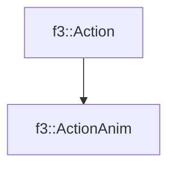

# f3::ActionAnim

[Return to `f3`](/docs/f3.md)

## C++

- [`ActionAnim.hpp`](/c++/include/ActionAnim.hpp)
- [`ActionAnim.cpp`](/c++/source/ActionAnim.cpp)

## References

- [`f3::Action`](/docs/f3/Action.md)

## Inheritance

[Return to `f3`](/docs/f3.md)