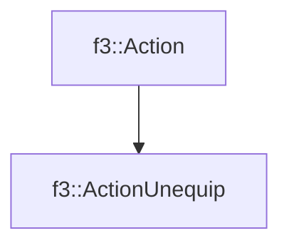

# f3::ActionUnequip

[Return to `f3`](/docs/f3.md)

## C++

- [`ActionUnequip.hpp`](/src/f3/ActionUnequip.hpp)
- [`ActionUnequip.cpp`](/src/f3/ActionUnequip.cpp)

## References

- [`f3::Action`](/docs/f3/Action.md)

## Inheritance

[Return to `f3`](/docs/f3.md)