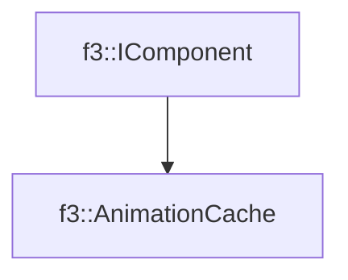

# f3::AnimationCache

[Return to `f3`](/docs/f3.md)

## C++

- [`AnimationCache.hpp`](/c++/include/AnimationCache.hpp)
- [`AnimationCache.cpp`](/c++/source/AnimationCache.cpp)

## References

- [`f3::IComponent`](/docs/f3/IComponent.md)

## Inheritance

[Return to `f3`](/docs/f3.md)