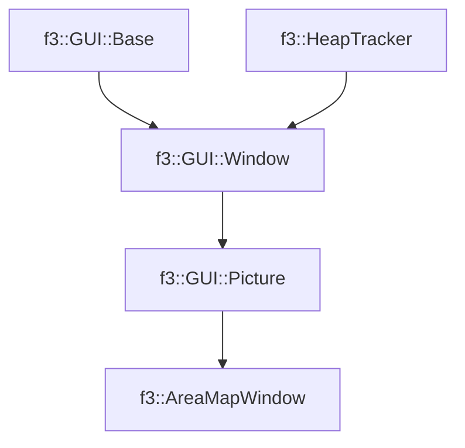

# f3::AreaMapWindow

[Return to `f3`](/docs/f3.md)

## C++

- [`AreaMapWindow.hpp`](/src/f3/AreaMapWindow.hpp)
- [`AreaMapWindow.cpp`](/src/f3/AreaMapWindow.cpp)

## References

- [`f3::GUI::Base`](/docs/f3/GUI/Base.md)
- [`f3::HeapTracker`](/docs/f3/HeapTracker.md)
- [`f3::GUI::Window`](/docs/f3/GUI/Window.md)
- [`f3::GUI::Picture`](/docs/f3/GUI/Picture.md)

## Inheritance

[Return to `f3`](/docs/f3.md)