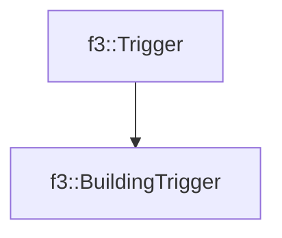

# f3::BuildingTrigger

[Return to `f3`](/docs/f3.md)

## C++

- [`BuildingTrigger.hpp`](/src/f3/BuildingTrigger.hpp)
- [`BuildingTrigger.cpp`](/src/f3/BuildingTrigger.cpp)

## References

- [`f3::Trigger`](/docs/f3/Trigger.md)

## Inheritance

[Return to `f3`](/docs/f3.md)