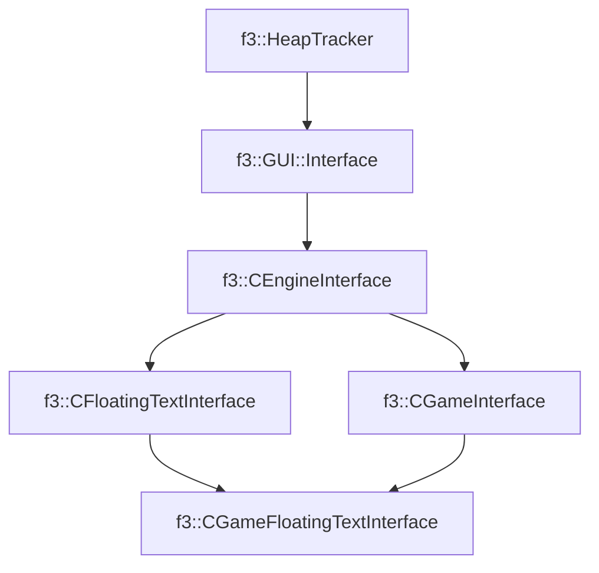

# f3::CGameFloatingTextInterface

[Return to `f3`](/docs/f3.md)

## C++

- [`CGameFloatingTextInterface.hpp`](/c++/include/CGameFloatingTextInterface.hpp)
- [`CGameFloatingTextInterface.cpp`](/c++/source/CGameFloatingTextInterface.cpp)

## References

- [`f3::HeapTracker`](/docs/f3/HeapTracker.md)
- [`f3::GUI::Interface`](/docs/f3/GUI/Interface.md)
- [`f3::CEngineInterface`](/docs/f3/CEngineInterface.md)
- [`f3::CFloatingTextInterface`](/docs/f3/CFloatingTextInterface.md)
- [`f3::CGameInterface`](/docs/f3/CGameInterface.md)

## Inheritance

[Return to `f3`](/docs/f3.md)