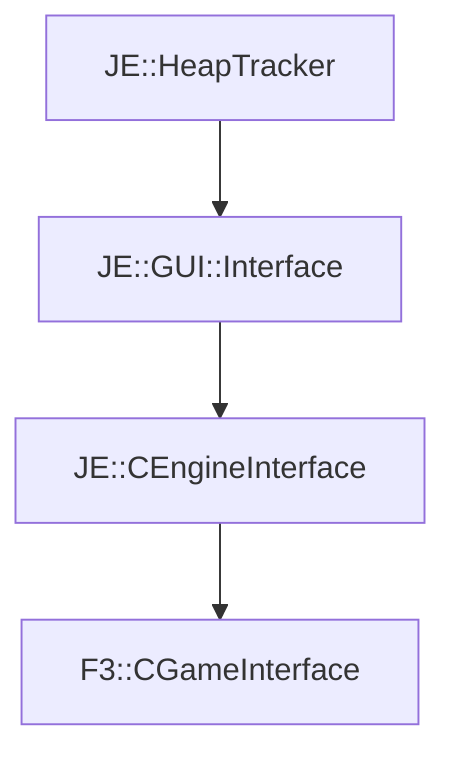

# F3::CGameInterface

[Return to `F3`](/docs/f3.md)

## C++

- [`CGameInterface.hpp`](/src/f3/CGameInterface.hpp)
- [`CGameInterface.cpp`](/src/f3/CGameInterface.cpp)

## References

- [`JE::HeapTracker`](https://github.com/OpenJE/openje/docs/je/HeapTracker.md)
- [`JE::GUI::Interface`](https://github.com/OpenJE/openje/docs/je/GUI/Interface.md)
- [`JE::CEngineInterface`](https://github.com/OpenJE/openje/docs/je/CEngineInterface.md)

## Inheritance

[Return to `F3`](/docs/f3.md)