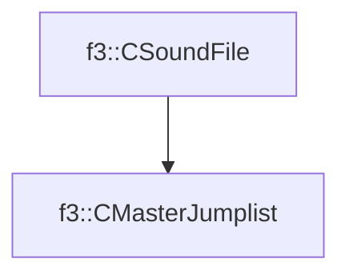

# f3::CMasterJumplist

[Return to `f3`](/docs/f3.md)

## C++

- [`CMasterJumplist.hpp`](/c++/include/CMasterJumplist.hpp)
- [`CMasterJumplist.cpp`](/c++/source/CMasterJumplist.cpp)

## References

- [`f3::CSoundFile`](/docs/f3/CSoundFile.md)

## Inheritance

[Return to `f3`](/docs/f3.md)