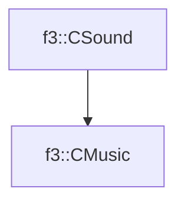

# f3::CMusic

[Return to `f3`](/docs/f3.md)

## C++

- [`CMusic.hpp`](/c++/include/CMusic.hpp)
- [`CMusic.cpp`](/c++/source/CMusic.cpp)

## References

- [`f3::CSound`](/docs/f3/CSound.md)

## Inheritance

[Return to `f3`](/docs/f3.md)