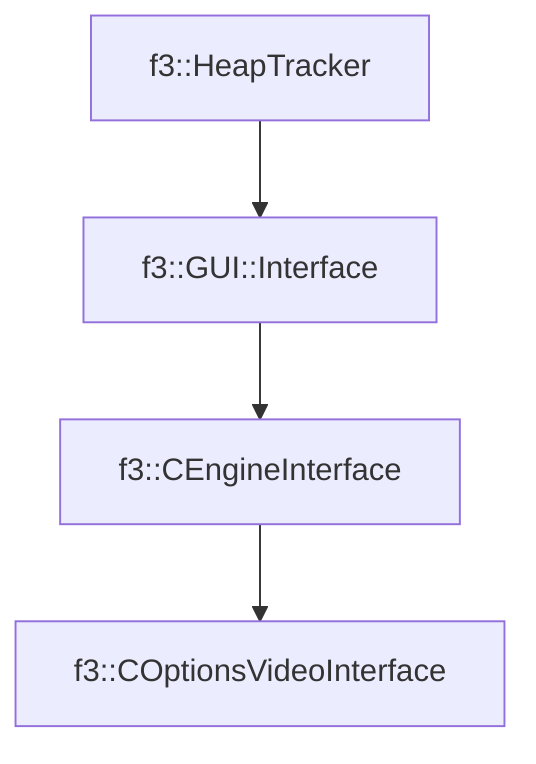

# f3::COptionsVideoInterface

[Return to `f3`](/docs/f3.md)

## C++

- [`COptionsVideoInterface.hpp`](/src/f3/COptionsVideoInterface.hpp)
- [`COptionsVideoInterface.cpp`](/src/f3/COptionsVideoInterface.cpp)

## References

- [`f3::HeapTracker`](/docs/f3/HeapTracker.md)
- [`f3::GUI::Interface`](/docs/f3/GUI/Interface.md)
- [`f3::CEngineInterface`](/docs/f3/CEngineInterface.md)

## Inheritance

[Return to `f3`](/docs/f3.md)