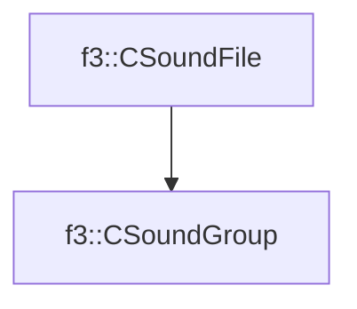

# f3::CSoundGroup

[Return to `f3`](/docs/f3.md)

## C++

- [`CSoundGroup.hpp`](/src/f3/CSoundGroup.hpp)
- [`CSoundGroup.cpp`](/src/f3/CSoundGroup.cpp)

## References

- [`f3::CSoundFile`](/docs/f3/CSoundFile.md)

## Inheritance

[Return to `f3`](/docs/f3.md)