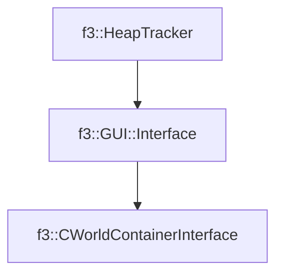

# f3::CWorldContainerInterface

[Return to `f3`](/docs/f3.md)

## C++

- [`CWorldContainerInterface.hpp`](/c++/include/CWorldContainerInterface.hpp)
- [`CWorldContainerInterface.cpp`](/c++/source/CWorldContainerInterface.cpp)

## References

- [`f3::HeapTracker`](/docs/f3/HeapTracker.md)
- [`f3::GUI::Interface`](/docs/f3/GUI/Interface.md)

## Inheritance

[Return to `f3`](/docs/f3.md)