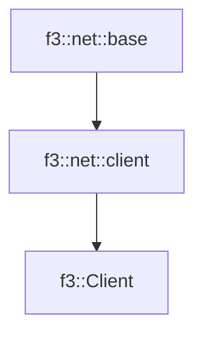

# f3::Client

[Return to `f3`](/docs/f3.md)

## C++

- [`Client.hpp`](/src/f3/Client.hpp)
- [`Client.cpp`](/src/f3/Client.cpp)

## References

- [`f3::net::base`](/docs/net/base.md)
- [`f3::net::client`](/docs/net/client.md)

## Inheritance

[Return to `f3`](/docs/f3.md)