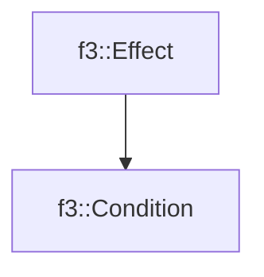

# f3::Condition

[Return to `f3`](/docs/f3.md)

## C++

- [`Condition.hpp`](/c++/include/Condition.hpp)
- [`Condition.cpp`](/c++/source/Condition.cpp)

## References

- [`f3::Effect`](/docs/f3/Effect.md)

## Inheritance

[Return to `f3`](/docs/f3.md)