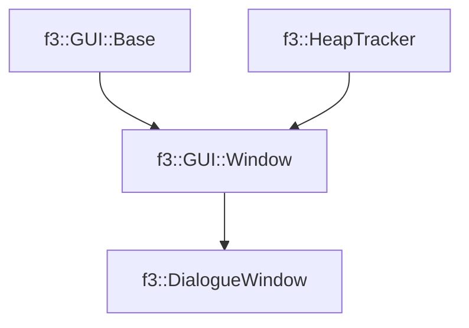

# f3::DialogueWindow

[Return to `f3`](/docs/f3.md)

## C++

- [`DialogueWindow.hpp`](/c++/include/DialogueWindow.hpp)
- [`DialogueWindow.cpp`](/c++/source/DialogueWindow.cpp)

## References

- [`f3::GUI::Base`](/docs/f3/GUI/Base.md)
- [`f3::HeapTracker`](/docs/f3/HeapTracker.md)
- [`f3::GUI::Window`](/docs/f3/GUI/Window.md)

## Inheritance

[Return to `f3`](/docs/f3.md)