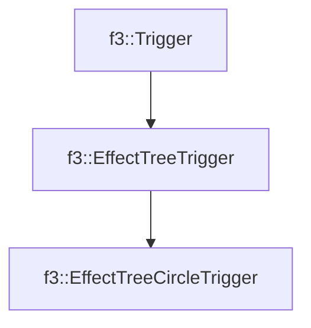

# f3::EffectTreeCircleTrigger

[Return to `f3`](/docs/f3.md)

## C++

- [`EffectTreeCircleTrigger.hpp`](/c++/include/EffectTreeCircleTrigger.hpp)
- [`EffectTreeCircleTrigger.cpp`](/c++/source/EffectTreeCircleTrigger.cpp)

## References

- [`f3::Trigger`](/docs/f3/Trigger.md)
- [`f3::EffectTreeTrigger`](/docs/f3/EffectTreeTrigger.md)

## Inheritance

[Return to `f3`](/docs/f3.md)