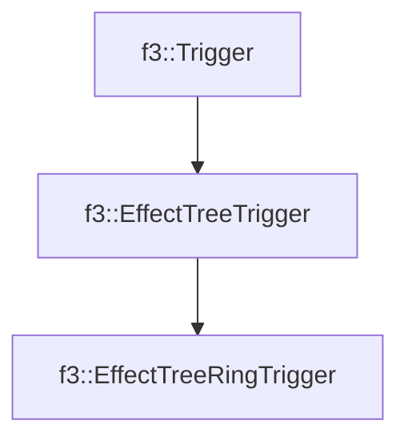

# f3::EffectTreeRingTrigger

[Return to `f3`](/docs/f3.md)

## C++

- [`EffectTreeRingTrigger.hpp`](/src/f3/EffectTreeRingTrigger.hpp)
- [`EffectTreeRingTrigger.cpp`](/src/f3/EffectTreeRingTrigger.cpp)

## References

- [`f3::Trigger`](/docs/f3/Trigger.md)
- [`f3::EffectTreeTrigger`](/docs/f3/EffectTreeTrigger.md)

## Inheritance

[Return to `f3`](/docs/f3.md)