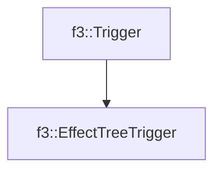

# f3::EffectTreeTrigger

[Return to `f3`](/docs/f3.md)

## C++

- [`EffectTreeTrigger.hpp`](/src/f3/EffectTreeTrigger.hpp)
- [`EffectTreeTrigger.cpp`](/src/f3/EffectTreeTrigger.cpp)

## References

- [`f3::Trigger`](/docs/f3/Trigger.md)

## Inheritance

[Return to `f3`](/docs/f3.md)