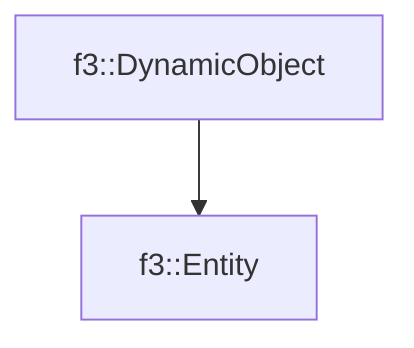

# f3::Entity

[Return to `f3`](/docs/f3.md)

## C++

- [`Entity.hpp`](/src/f3/Entity.hpp)
- [`Entity.cpp`](/src/f3/Entity.cpp)

## References

- [`f3::DynamicObject`](/docs/f3/DynamicObject.md)

## Inheritance

[Return to `f3`](/docs/f3.md)