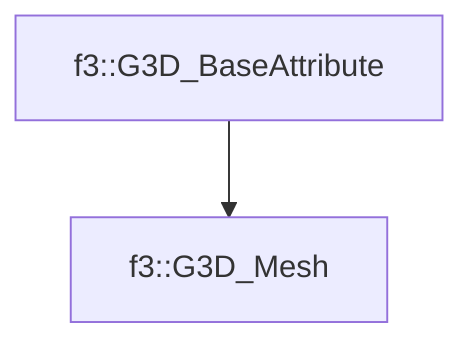

# f3::G3D_Mesh

[Return to `f3`](/docs/f3.md)

## C++

- [`G3D_Mesh.hpp`](/src/f3/G3D_Mesh.hpp)
- [`G3D_Mesh.cpp`](/src/f3/G3D_Mesh.cpp)

## References

- [`f3::G3D_BaseAttribute`](/docs/f3/G3D_BaseAttribute.md)

## Inheritance

[Return to `f3`](/docs/f3.md)