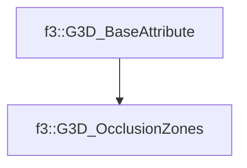

# f3::G3D_OcclusionZones

[Return to `f3`](/docs/f3.md)

## C++

- [`G3D_OcclusionZones.hpp`](/src/f3/G3D_OcclusionZones.hpp)
- [`G3D_OcclusionZones.cpp`](/src/f3/G3D_OcclusionZones.cpp)

## References

- [`f3::G3D_BaseAttribute`](/docs/f3/G3D_BaseAttribute.md)

## Inheritance

[Return to `f3`](/docs/f3.md)