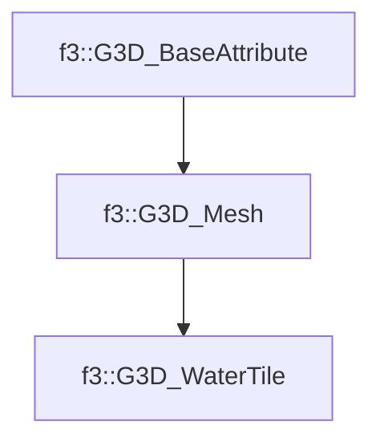

# f3::G3D_WaterTile

[Return to `f3`](/docs/f3.md)

## C++

- [`G3D_WaterTile.hpp`](/c++/include/G3D_WaterTile.hpp)
- [`G3D_WaterTile.cpp`](/c++/source/G3D_WaterTile.cpp)

## References

- [`f3::G3D_BaseAttribute`](/docs/f3/G3D_BaseAttribute.md)
- [`f3::G3D_Mesh`](/docs/f3/G3D_Mesh.md)

## Inheritance

[Return to `f3`](/docs/f3.md)