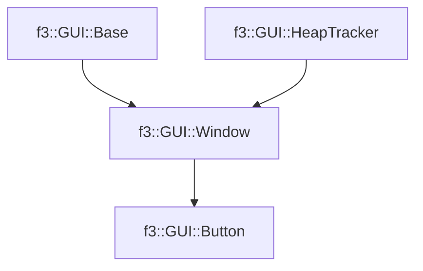

# f3::GUI::Button

[Return to `f3`](/docs/f3.md)

## C++

- [`Button.hpp`](/src/f3/Button.hpp)
- [`Button.cpp`](/src/f3/Button.cpp)

## Inheritance

```mermaid
graph TD;
    f3::GUI::Base-->f3::GUI::Window
    f3::GUI::HeapTracker-->f3::GUI::Window
    f3::GUI::Window-->f3::GUI::Button
```

[Return to `f3`](/docs/f3.md)