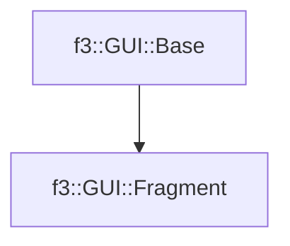

# f3::GUI::Fragment

[Return to `f3`](/docs/f3.md)

## C++

- [`Fragment.hpp`](/src/f3/Fragment.hpp)
- [`Fragment.cpp`](/src/f3/Fragment.cpp)

## Inheritance

```mermaid
graph TD;
    f3::GUI::Base-->f3::GUI::Fragment
```

[Return to `f3`](/docs/f3.md)