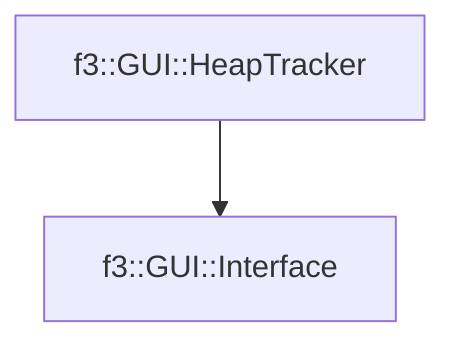

# f3::GUI::Interface

[Return to `f3`](/docs/f3.md)

## C++

- [`Interface.hpp`](/src/f3/Interface.hpp)
- [`Interface.cpp`](/src/f3/Interface.cpp)

## Inheritance

```mermaid
graph TD;
    f3::GUI::HeapTracker-->f3::GUI::Interface
```

[Return to `f3`](/docs/f3.md)