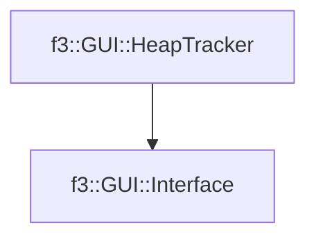

# f3::GUI::Interface

[Return to `f3`](/docs/f3.md)

## C++

- [`Interface.hpp`](/c++/include/Interface.hpp)
- [`Interface.cpp`](/c++/source/Interface.cpp)

## Inheritance

[Return to `f3`](/docs/f3.md)