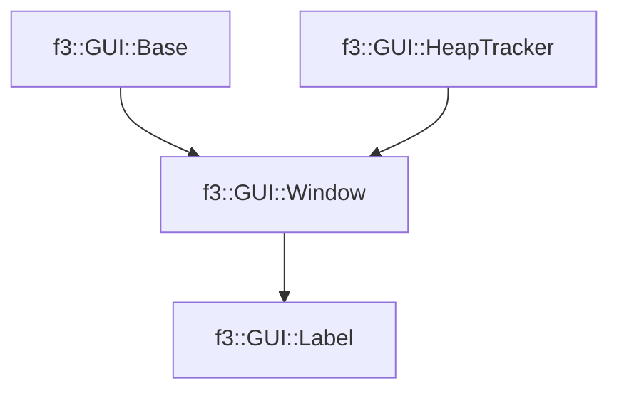

# f3::GUI::Label

[Return to `f3`](/docs/f3.md)

## C++

- [`Label.hpp`](/src/f3/Label.hpp)
- [`Label.cpp`](/src/f3/Label.cpp)

## Inheritance

```mermaid
graph TD;
    f3::GUI::Base-->f3::GUI::Window
    f3::GUI::HeapTracker-->f3::GUI::Window
    f3::GUI::Window-->f3::GUI::Label
```

[Return to `f3`](/docs/f3.md)