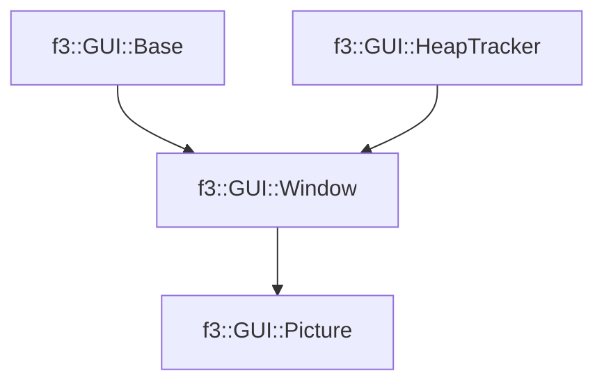

# f3::GUI::Picture

[Return to `f3`](/docs/f3.md)

## C++

- [`Picture.hpp`](/c++/include/Picture.hpp)
- [`Picture.cpp`](/c++/source/Picture.cpp)

## Inheritance

```mermaid
graph TD;
    f3::GUI::Base-->f3::GUI::Window
    f3::GUI::HeapTracker-->f3::GUI::Window
    f3::GUI::Window-->f3::GUI::Picture
```

[Return to `f3`](/docs/f3.md)