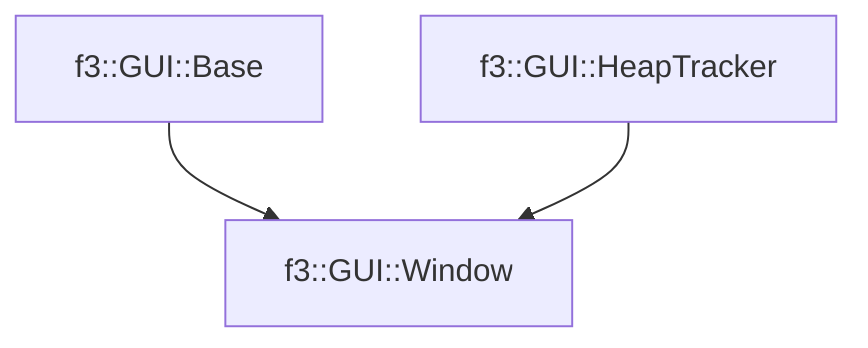

# f3::GUI::Window

[Return to `f3`](/docs/f3.md)

## C++

- [`Window.hpp`](/c++/include/Window.hpp)
- [`Window.cpp`](/c++/source/Window.cpp)

## Inheritance

```mermaid
graph TD;
    f3::GUI::Base-->f3::GUI::Window
    f3::GUI::HeapTracker-->f3::GUI::Window
```

[Return to `f3`](/docs/f3.md)