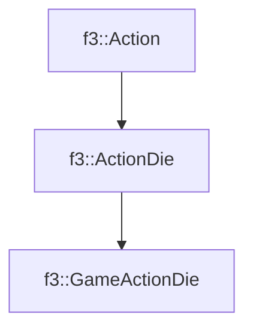

# f3::GameActionDie

[Return to `f3`](/docs/f3.md)

## C++

- [`GameActionDie.hpp`](/c++/include/GameActionDie.hpp)
- [`GameActionDie.cpp`](/c++/source/GameActionDie.cpp)

## References

- [`f3::Action`](/docs/f3/Action.md)
- [`f3::ActionDie`](/docs/f3/ActionDie.md)

## Inheritance

[Return to `f3`](/docs/f3.md)