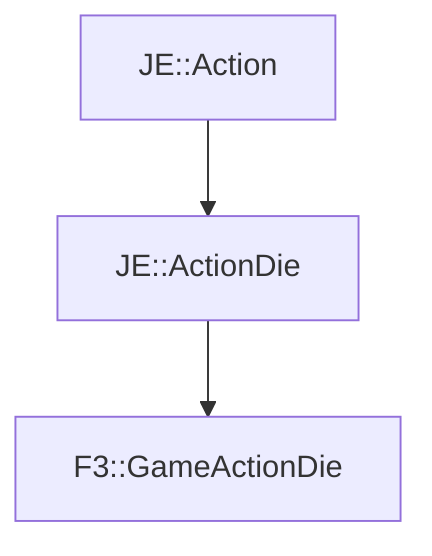

# F3::GameActionDie

[Return to `F3`](/docs/f3.md)

## C++

- [`GameActionDie.hpp`](/src/f3/GameActionDie.hpp)
- [`GameActionDie.cpp`](/src/f3/GameActionDie.cpp)

## References

- [`JE::Action`](https://github.com/OpenJE/openje/docs/je/Action.md)
- [`JE::ActionDie`](https://github.com/OpenJE/openje/docs/je/ActionDie.md)

## Inheritance

[Return to `F3`](/docs/f3.md)