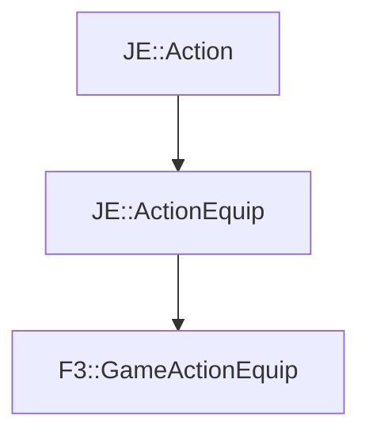

# F3::GameActionEquip

[Return to `F3`](/docs/f3.md)

## C++

- [`GameActionEquip.hpp`](/src/f3/GameActionEquip.hpp)
- [`GameActionEquip.cpp`](/src/f3/GameActionEquip.cpp)

## References

- [`JE::Action`](https://github.com/OpenJE/openje/docs/je/Action.md)
- [`JE::ActionEquip`](https://github.com/OpenJE/openje/docs/je/ActionEquip.md)

## Inheritance

[Return to `F3`](/docs/f3.md)