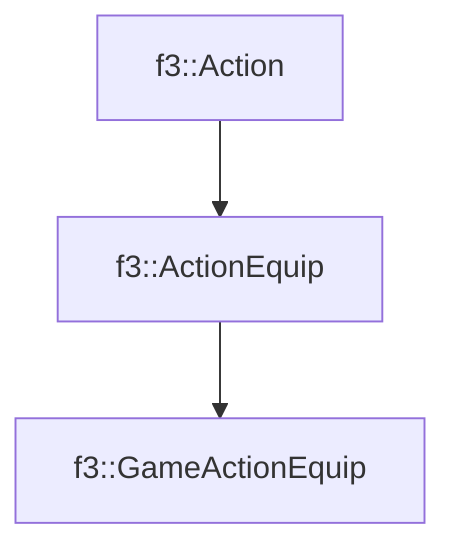

# f3::GameActionEquip

[Return to `f3`](/docs/f3.md)

## C++

- [`GameActionEquip.hpp`](/c++/include/GameActionEquip.hpp)
- [`GameActionEquip.cpp`](/c++/source/GameActionEquip.cpp)

## References

- [`f3::Action`](/docs/f3/Action.md)
- [`f3::ActionEquip`](/docs/f3/ActionEquip.md)

## Inheritance

[Return to `f3`](/docs/f3.md)