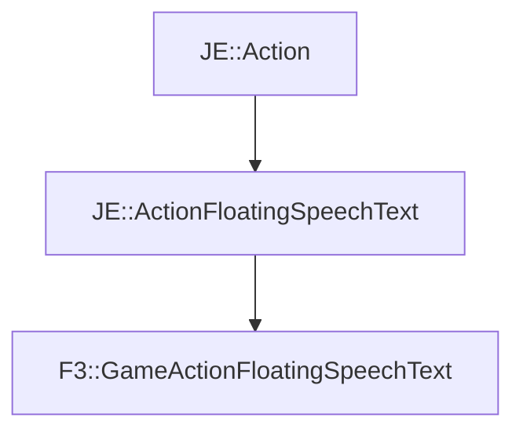

# F3::GameActionFloatingSpeechText

[Return to `F3`](/docs/f3.md)

## C++

- [`GameActionFloatingSpeechText.hpp`](/src/f3/GameActionFloatingSpeechText.hpp)
- [`GameActionFloatingSpeechText.cpp`](/src/f3/GameActionFloatingSpeechText.cpp)

## References

- [`JE::Action`](https://github.com/OpenJE/openje/docs/je/Action.md)
- [`JE::ActionFloatingSpeechText`](https://github.com/OpenJE/openje/docs/je/ActionFloatingSpeechText.md)

## Inheritance

[Return to `F3`](/docs/f3.md)