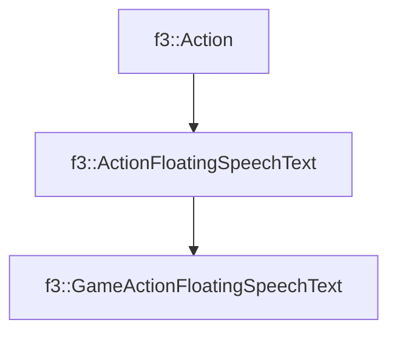

# f3::GameActionFloatingSpeechText

[Return to `f3`](/docs/f3.md)

## C++

- [`GameActionFloatingSpeechText.hpp`](/src/f3/GameActionFloatingSpeechText.hpp)
- [`GameActionFloatingSpeechText.cpp`](/src/f3/GameActionFloatingSpeechText.cpp)

## References

- [`f3::Action`](/docs/f3/Action.md)
- [`f3::ActionFloatingSpeechText`](/docs/f3/ActionFloatingSpeechText.md)

## Inheritance

[Return to `f3`](/docs/f3.md)