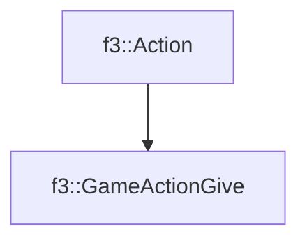

# f3::GameActionGive

[Return to `f3`](/docs/f3.md)

## C++

- [`GameActionGive.hpp`](/src/f3/GameActionGive.hpp)
- [`GameActionGive.cpp`](/src/f3/GameActionGive.cpp)

## References

- [`f3::Action`](/docs/f3/Action.md)

## Inheritance

[Return to `f3`](/docs/f3.md)