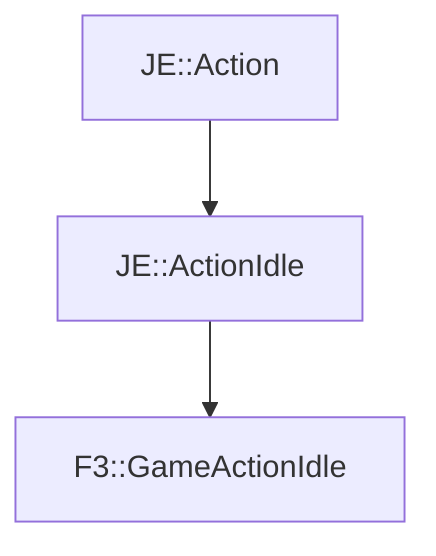

# F3::GameActionIdle

[Return to `F3`](/docs/f3.md)

## C++

- [`GameActionIdle.hpp`](/src/f3/GameActionIdle.hpp)
- [`GameActionIdle.cpp`](/src/f3/GameActionIdle.cpp)

## References

- [`JE::Action`](https://github.com/OpenJE/openje/docs/je/Action.md)
- [`JE::ActionIdle`](https://github.com/OpenJE/openje/docs/je/ActionIdle.md)

## Inheritance

[Return to `F3`](/docs/f3.md)