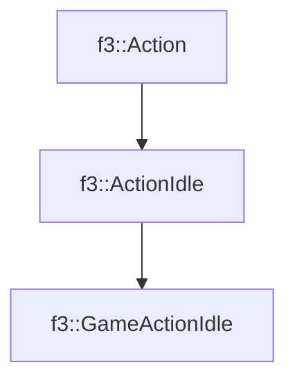

# f3::GameActionIdle

[Return to `f3`](/docs/f3.md)

## C++

- [`GameActionIdle.hpp`](/src/f3/GameActionIdle.hpp)
- [`GameActionIdle.cpp`](/src/f3/GameActionIdle.cpp)

## References

- [`f3::Action`](/docs/f3/Action.md)
- [`f3::ActionIdle`](/docs/f3/ActionIdle.md)

## Inheritance

[Return to `f3`](/docs/f3.md)