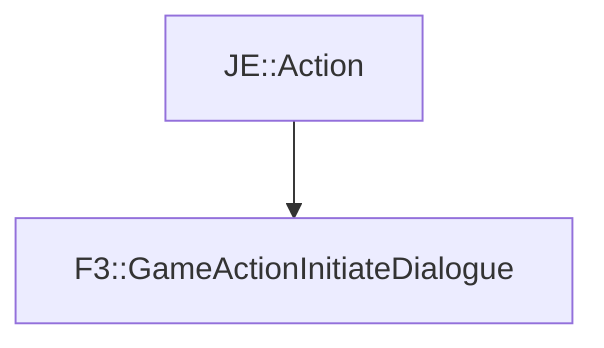

# F3::GameActionInitiateDialogue

[Return to `F3`](/docs/f3.md)

## C++

- [`GameActionInitiateDialogue.hpp`](/src/f3/GameActionInitiateDialogue.hpp)
- [`GameActionInitiateDialogue.cpp`](/src/f3/GameActionInitiateDialogue.cpp)

## References

- [`JE::Action`](https://github.com/OpenJE/openje/docs/je/Action.md)

## Inheritance

[Return to `F3`](/docs/f3.md)