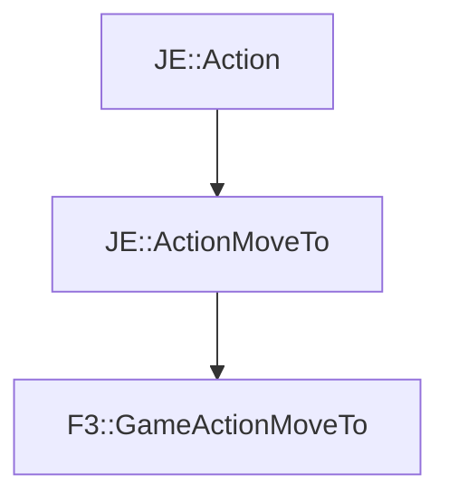

# F3::GameActionMoveTo

[Return to `F3`](/docs/f3.md)

## C++

- [`GameActionMoveTo.hpp`](/src/f3/GameActionMoveTo.hpp)
- [`GameActionMoveTo.cpp`](/src/f3/GameActionMoveTo.cpp)

## References

- [`JE::Action`](https://github.com/OpenJE/openje/docs/je/Action.md)
- [`JE::ActionMoveTo`](https://github.com/OpenJE/openje/docs/je/ActionMoveTo.md)

## Inheritance

[Return to `F3`](/docs/f3.md)