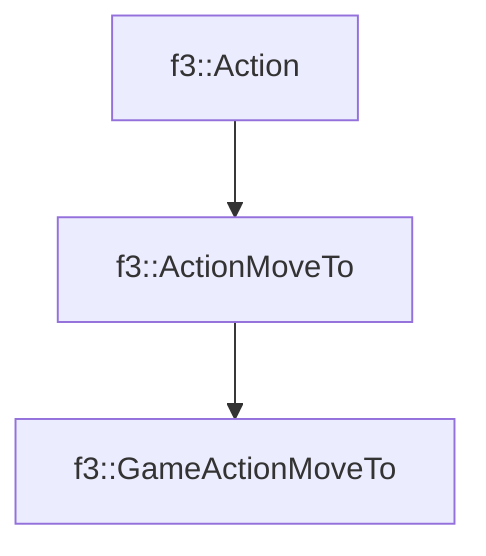

# f3::GameActionMoveTo

[Return to `f3`](/docs/f3.md)

## C++

- [`GameActionMoveTo.hpp`](/src/f3/GameActionMoveTo.hpp)
- [`GameActionMoveTo.cpp`](/src/f3/GameActionMoveTo.cpp)

## References

- [`f3::Action`](/docs/f3/Action.md)
- [`f3::ActionMoveTo`](/docs/f3/ActionMoveTo.md)

## Inheritance

[Return to `f3`](/docs/f3.md)