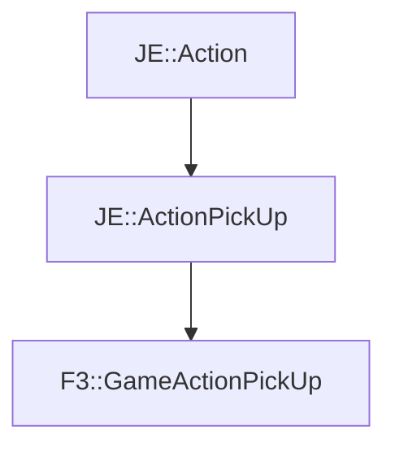

# F3::GameActionPickUp

[Return to `F3`](/docs/f3.md)

## C++

- [`GameActionPickUp.hpp`](/src/f3/GameActionPickUp.hpp)
- [`GameActionPickUp.cpp`](/src/f3/GameActionPickUp.cpp)

## References

- [`JE::Action`](https://github.com/OpenJE/openje/docs/je/Action.md)
- [`JE::ActionPickUp`](https://github.com/OpenJE/openje/docs/je/ActionPickUp.md)

## Inheritance

[Return to `F3`](/docs/f3.md)