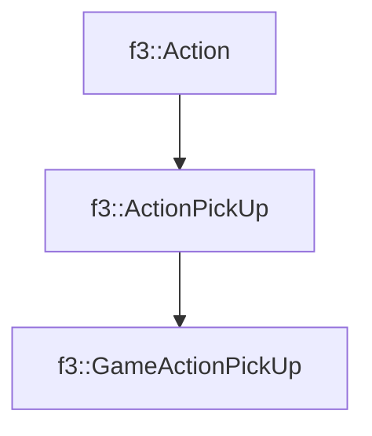

# f3::GameActionPickUp

[Return to `f3`](/docs/f3.md)

## C++

- [`GameActionPickUp.hpp`](/src/f3/GameActionPickUp.hpp)
- [`GameActionPickUp.cpp`](/src/f3/GameActionPickUp.cpp)

## References

- [`f3::Action`](/docs/f3/Action.md)
- [`f3::ActionPickUp`](/docs/f3/ActionPickUp.md)

## Inheritance

[Return to `f3`](/docs/f3.md)