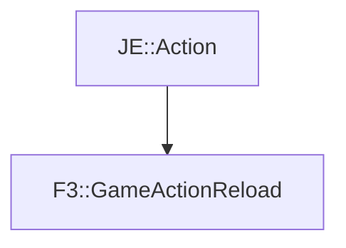

# F3::GameActionReload

[Return to `F3`](/docs/f3.md)

## C++

- [`GameActionReload.hpp`](/src/f3/GameActionReload.hpp)
- [`GameActionReload.cpp`](/src/f3/GameActionReload.cpp)

## References

- [`JE::Action`](https://github.com/OpenJE/openje/docs/je/Action.md)

## Inheritance

[Return to `F3`](/docs/f3.md)