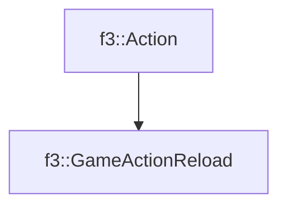

# f3::GameActionReload

[Return to `f3`](/docs/f3.md)

## C++

- [`GameActionReload.hpp`](/c++/include/GameActionReload.hpp)
- [`GameActionReload.cpp`](/c++/source/GameActionReload.cpp)

## References

- [`f3::Action`](/docs/f3/Action.md)

## Inheritance

[Return to `f3`](/docs/f3.md)