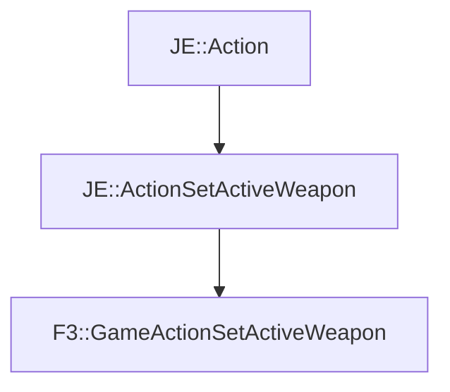

# F3::GameActionSetActiveWeapon

[Return to `F3`](/docs/f3.md)

## C++

- [`GameActionSetActiveWeapon.hpp`](/src/f3/GameActionSetActiveWeapon.hpp)
- [`GameActionSetActiveWeapon.cpp`](/src/f3/GameActionSetActiveWeapon.cpp)

## References

- [`JE::Action`](https://github.com/OpenJE/openje/docs/je/Action.md)
- [`JE::ActionSetActiveWeapon`](https://github.com/OpenJE/openje/docs/je/ActionSetActiveWeapon.md)

## Inheritance

[Return to `F3`](/docs/f3.md)