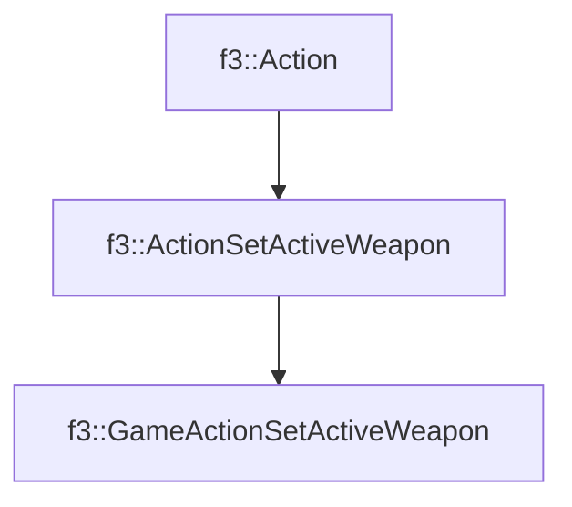

# f3::GameActionSetActiveWeapon

[Return to `f3`](/docs/f3.md)

## C++

- [`GameActionSetActiveWeapon.hpp`](/c++/include/GameActionSetActiveWeapon.hpp)
- [`GameActionSetActiveWeapon.cpp`](/c++/source/GameActionSetActiveWeapon.cpp)

## References

- [`f3::Action`](/docs/f3/Action.md)
- [`f3::ActionSetActiveWeapon`](/docs/f3/ActionSetActiveWeapon.md)

## Inheritance

[Return to `f3`](/docs/f3.md)