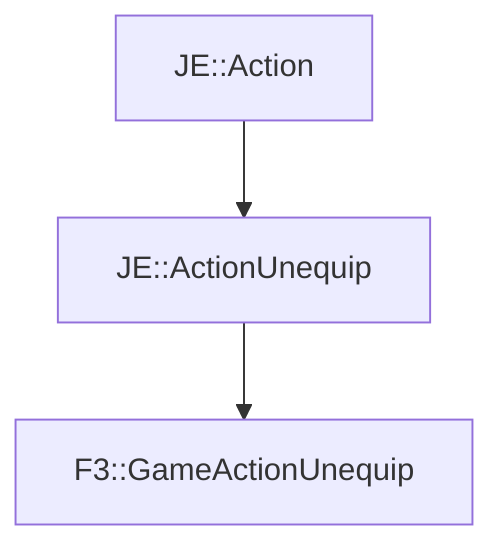

# F3::GameActionUnequip

[Return to `F3`](/docs/f3.md)

## C++

- [`GameActionUnequip.hpp`](/src/f3/GameActionUnequip.hpp)
- [`GameActionUnequip.cpp`](/src/f3/GameActionUnequip.cpp)

## References

- [`JE::Action`](https://github.com/OpenJE/openje/docs/je/Action.md)
- [`JE::ActionUnequip`](https://github.com/OpenJE/openje/docs/je/ActionUnequip.md)

## Inheritance

[Return to `F3`](/docs/f3.md)