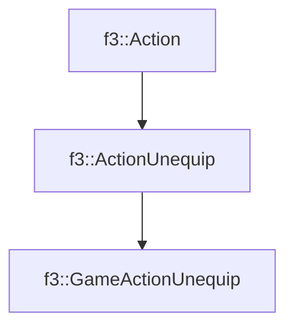

# f3::GameActionUnequip

[Return to `f3`](/docs/f3.md)

## C++

- [`GameActionUnequip.hpp`](/src/f3/GameActionUnequip.hpp)
- [`GameActionUnequip.cpp`](/src/f3/GameActionUnequip.cpp)

## References

- [`f3::Action`](/docs/f3/Action.md)
- [`f3::ActionUnequip`](/docs/f3/ActionUnequip.md)

## Inheritance

[Return to `f3`](/docs/f3.md)