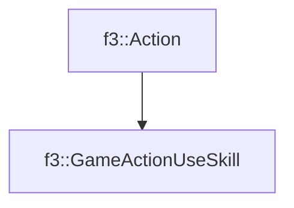

# f3::GameActionUseSkill

[Return to `f3`](/docs/f3.md)

## C++

- [`GameActionUseSkill.hpp`](/c++/include/GameActionUseSkill.hpp)
- [`GameActionUseSkill.cpp`](/c++/source/GameActionUseSkill.cpp)

## References

- [`f3::Action`](/docs/f3/Action.md)

## Inheritance

[Return to `f3`](/docs/f3.md)